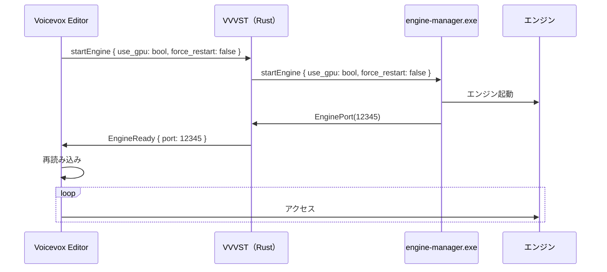
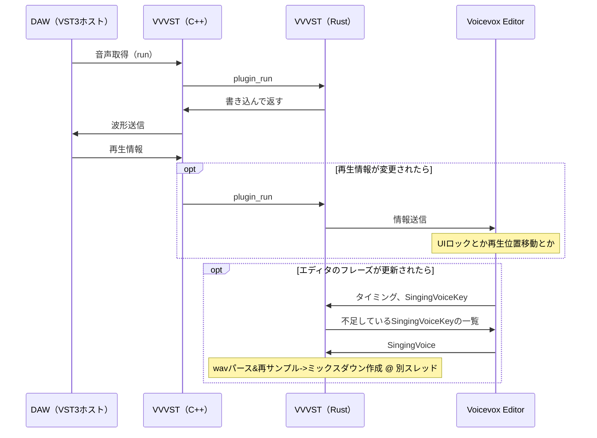

# シーケンス

このファイルには色々な場面のシーケンスが記載されています。

## エンジンの起動

```mermaid
sequenceDiagram
    participant vue as Voicevox Editor
    participant rust as VVVST（Rust）
    participant manager as engine-manager.exe
    participant engine as エンジン

    vue->>rust: startEngine { use_gpu: bool, force_restart: false }
    rust->>manager: startEngine { use_gpu: bool, force_restart: false }
    manager->>engine: エンジン起動
    manager->>rust: EnginePort(12345)
    rust->>vue: EngineReady { port: 12345 }
    vue->>vue: 再読み込み
    loop
        vue->>engine: アクセス
    end
```

## 音声の再生

```mermaid
sequenceDiagram
    participant daw as DAW（VST3ホスト）
    participant cpp as VVVST（C++）
    participant rust as VVVST（Rust）
    participant vue as Voicevox Editor

    daw->>cpp: 音声取得（run）
    cpp->>rust: plugin_run
    rust->>cpp: 書き込んで返す
    cpp->>daw: 波形送信
    daw->>cpp: 再生情報
    opt 再生情報が変更されたら
      cpp->>rust: plugin_run
      rust->>vue: 情報送信
      Note over vue: UIロックとか再生位置移動とか
    end

    opt エディタのフレーズが更新されたら
        vue->>rust: タイミング、SingingVoiceKey
        rust->>vue: 不足しているSingingVoiceKeyの一覧
        vue->>rust: SingingVoice
        Note over rust: wavパース&再サンプル->ミックスダウン作成 @ 別スレッド
    end
```
